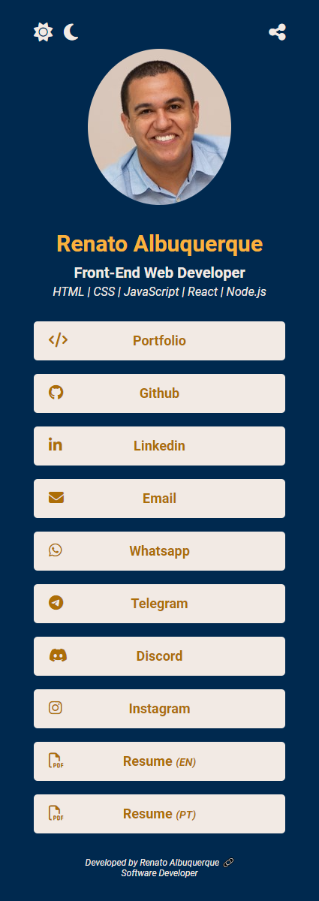
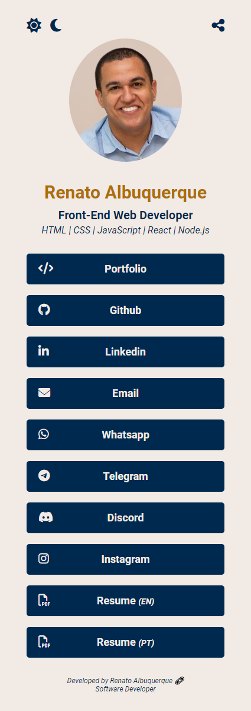

# Digital Business Card, Renato Albuquerque, Software Developer

Solution that includes all user links, as well as file downloads (Example: resume). Project start: November 2022. Project update: July 2023.

"Mobile first" project for 320px, 375px and 425px screens, developed in HTML, CSS and JavaScript. Some relevant features: "dark/light mode" and "share button". Other relevant aspects: Added "name meta tags" (author, description, keywords) to optimize the page content with search engines.

## Table of contents

- [Overview](#overview)
  - [The challenge](#the-challenge)
  - [Screenshot](#screenshot)
  - [Links](#links)
- [My process](#my-process)
  - [Built with](#built-with)
- [Author](#author)

## Overview

### The challenge

Users should be able to:

- View the optimal layout for the site depending on their device's screen size (Developed for the breakpoints: 320px, 375px and 425px)
- See hover states for all interactive elements on the page
- Send the website through the button share
- Change page theme between dark and light mode

### Screenshot

### Links

- [Solution URL here](https://github.com/renato-albuquerque/rma-contacts)
- [Live Site URL here](https://rma-contacts.vercel.app/)

## My process

### Built with

- Semantic HTML5 markup
- CSS custom properties
- Flexbox
- JavaScript
- Mobile-first workflow

## Author

- Business Card - [Renato Albuquerque](https://rma-contacts.vercel.app/)
- Linkedin - [renato-malbuquerque](https://www.linkedin.com/in/renato-malbuquerque/)
- Discord - [Renato Albuquerque#0025](https://discordapp.com/users/992621595547938837)